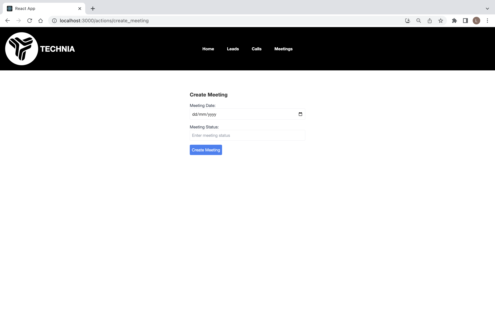

# Technia Frontend Task

## Project Description
This is a frontend web application developed for managing leads and actions (calls and meetings). The project is built with **React**, and it interacts with an API to perform CRUD operations for both leads and actions.

## Features
- View, create, update, and delete leads.
- View, create, update, and delete calls and meetings.
- Responsive and modern UI with easy navigation.

## How to Run the Project

1. **Clone the repository:**

   ```bash
   git clone https://github.com/LojainElsalnty/technia-frontend.git
   cd technia-frontend
2. **Install dependencies:**
Ensure you have Node.js installed on your machine. Then, in the project directory, run:

    ```bash
    npm install

3. **Start the development server:**
After the dependencies are installed, start the application with:

 ```bash
    npm start

The application will run at http://localhost:3000/.

## ScreenShots



